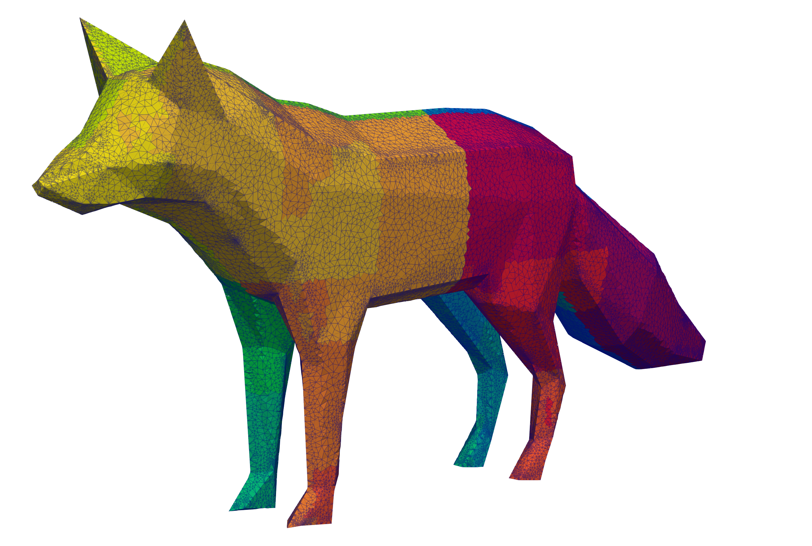

# Fox Example

Constructs a 3D Voronoi diagram from point clouds shaped as a fox. Optionally exports the result to VTK format.



## Prerequisites

MadVoro must be built and installed with **MPI** support. For VTK output, MadVoro must also be built with `--with-vtk`.

## Building

```bash
MADVORO_PREFIX=/path/to/madvoro/install BOOST_DIR=/path/to/boost bash build.sh
```

To enable VTK output, also set `VTK_DIR` (and `HDF5_DIR` if needed):

```bash
MADVORO_PREFIX=... BOOST_DIR=... VTK_DIR=/path/to/vtk HDF5_DIR=/path/to/hdf5 bash build.sh
```

## Running

```bash
mpirun -np <N> ./test
```

## Viewing the result

If built with VTK support, the output is written to `fox.pvtu` (with per-rank `.vtu` files in the `fox/` directory). Open `fox.pvtu` in [ParaView](https://www.paraview.org/) and apply a threshold filter on the `isInside` field (value = 1) to see the fox shape.
